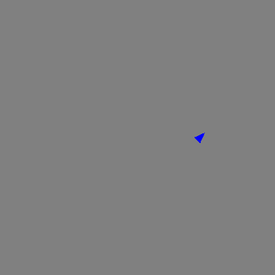

## Make a snowflake

Make a new shape that looks like a snowflake.

## Step 1

**Delete the code** from the previous shape you made.

## Step 2

Start a **new shape** by drawing at the side of the screen. Add `penup()` and `pendown()` to your code.

```python filename="main.py" line_numbers="true" line_number_start="1" line_highlights="11-14"
import turtle
import random

my_turtle = turtle.Turtle()
my_turtle.speed(4)
my_turtle.color('blue')
turtle.Screen().bgcolor('grey')
colours = ["cyan", "purple", "white", "blue"]

# Make a shape
my_turtle.penup()
my_turtle.forward(90)
my_turtle.left(45)
my_turtle.pendown()
```

## Now run your code

Check that the turtle moves to a new starting point before it begins drawing.


