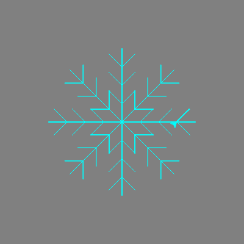

<h2 class="c-project-heading--task">Repeat to make the snowflake</h2>
--- task ---

Put `branch()` in a loop so that it draws it eight times.

--- /task ---

--- code ---
---
language: python
filename: main.py
line_numbers: true
line_number_start: 24
line_highlights: 28-30
---
    my_turtle.right(90)
    my_turtle.forward(90)

for i in range(8):
    branch()
    my_turtle.left(45)
--- /code ---

--- task ---

**Run** your code, the turtle should be drawing the snowflake.

--- /task ---

 

