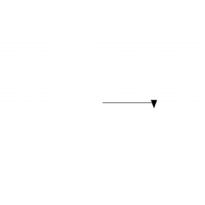

<h2 class="c-project-heading--task">Turn your turtle</h2>

Add code that **turns** `my_turtle` to draw your shape.

--- code ---
---
language: python
filename: main.py
line_numbers: true
line_number_start: 1
line_highlights: 8
---
import turtle

my_turtle = turtle.Turtle()
my_turtle.speed(4)

# Make a shape
my_turtle.forward(100)
my_turtle.right(90)

--- /code ---

## Now run your code

Check that the turtle draws a line and then turns. Experiment with `right` and `left` to change the direction. Change the number to turn the turtle more or less.

### Tip

The value `90` inside the brackets is in degrees. So this line tells your turtle to turn right by 90 degrees.

