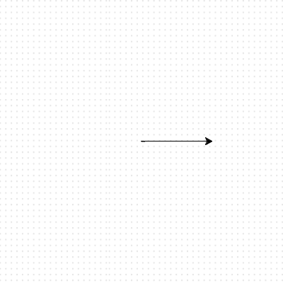

<h2 class="c-project-heading--task">Make the turtle move</h2>
--- task ---

Tell your turtle to move forward `100`. Give it a go!

--- /task ---

--- code ---
---
language: python
filename: main.py
line_numbers: true
line_number_start: 1
line_highlights: 6
---
import turtle

my_turtle = turtle.Turtle()
my_turtle.speed(20)

my_turtle.forward(100)
--- /code ---

--- task ---

Click on **Run** to run the Turtle program. Change the **speed** number if you want the turtle to draw faster or slower. Change the **forward** number to move it more or less. 

--- /task ---  

