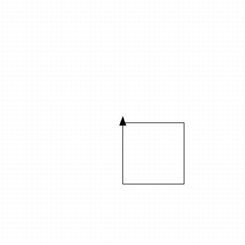

<h2 class="c-project-heading--task">Make a square</h2>

Add the following code to to make a square

--- code ---
---
language: python
filename: main.py
line_numbers: true
line_number_start: 3
line_highlights: 9-13
---
my_turtle = turtle.Turtle()
my_turtle.speed(4)

# Make a shape
my_turtle.forward(100)
my_turtle.right(90)
my_turtle.forward(100)
my_turtle.right(90)
my_turtle.forward(100)
my_turtle.right(90)
my_turtle.forward(100)
--- /code ---

## Now run your code

Check that the turtle draws a square.

