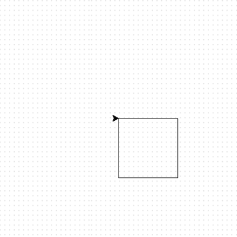

<h2 class="c-project-heading--task">Use a loop</h2>

Instead of typing out many lines of code, it's easier to use a loop.

<h2 class="c-project-heading--explainer">Follow these instructions</h2>

## Step 1

**Delete the code** you added to make a square. Put the first two lines in a loop.

--- code ---
---
language: python
filename: main.py
line_numbers: true
line_number_start: 3
line_highlights: 7-9
---
my_turtle = turtle.Turtle()
my_turtle.speed(4)

# Make a shape
for i in range(4):
    my_turtle.forward(100)
    my_turtle.right(90)
--- /code ---  

## Step 2

See what happens when you **run** your code.

### Debugging

Make sure your code is indented like the example.

## Now run your code

Run your code and check that the loop draws a square.
