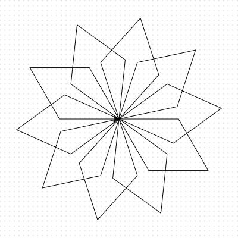

## Loops in loops

You can put loops inside of other loops to repeat and overlap shapes.

Add an outer loop in the line above `for i in range(2):`.

```python filename="main.py" line_numbers="true" line_number_start="3" line_highlights="7-13"
my_turtle = turtle.Turtle()
my_turtle.speed(4)

# Make a shape
for i in range(10):
    for i in range(2):
        my_turtle.forward(100)
        my_turtle.right(60)
        my_turtle.forward(100)
        my_turtle.right(120)
    my_turtle.right(36)
```

## Now run your code

Check that the repeated shape makes a snowflake pattern.



> [!TIP]
>
> Make sure to indent the code below a loop.
