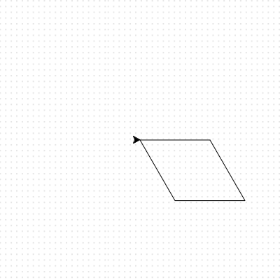

<h2 class="c-project-heading--task">Create different shapes</h2>
--- task ---

Replace the code for your square with the following, and experiment to make different shapes.

--- /task ---

--- code ---
---
language: python
filename: main.py
line_numbers: true
line_number_start: 1
line_highlights: 6-10
---
import turtle

my_turtle = turtle.Turtle()
my_turtle.speed(4)

for i in range(2):
    my_turtle.forward(100)
    my_turtle.right(60)
    my_turtle.forward(100)
    my_turtle.right(120)
--- /code --- 

--- task ---

 Run the code and it will draw a shape called a parallelogram.
  
--- /task ---

 

