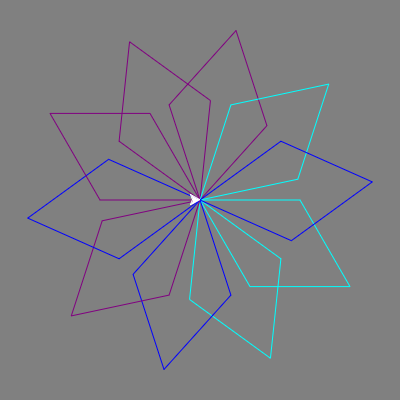

<h2 class="c-project-heading--task">Add a random colour</h2>

Add the code so that every time you run your code, you will get a slightly different snowflake.

<h2 class="c-project-heading--explainer">Follow these instructions</h2>

## Step 1

First import the `random` library. Then create a list called `colours` to store colours to select from.

## Step 2

At the end of the loop, choose a random colour from the list.

--- code ---
---
language: python
filename: main.py
line_numbers: true
line_number_start: 1
line_highlights: 2, 8, 18
---
import turtle
import random

my_turtle = turtle.Turtle()
my_turtle.speed(4)
my_turtle.color('blue')
turtle.Screen().bgcolor('grey')
colours = ["cyan", "purple", "white", "blue"]

# Make a shape
for i in range(10):
    for i in range(2):
        my_turtle.forward(100)
        my_turtle.right(60)
        my_turtle.forward(100)
        my_turtle.right(120)
    my_turtle.right(36)
    my_turtle.color(random.choice(colours))
--- /code ---

## Step 3

**Test** your code, and experiment with adding colours to your list.

### Tip

There are a lot more colours you can choose from! Have a look at [this website](https://wiki.tcl.tk/37701) for a complete list.

## Now run your code

Test your code and check that different parts of the snowflake use colours from your list.
